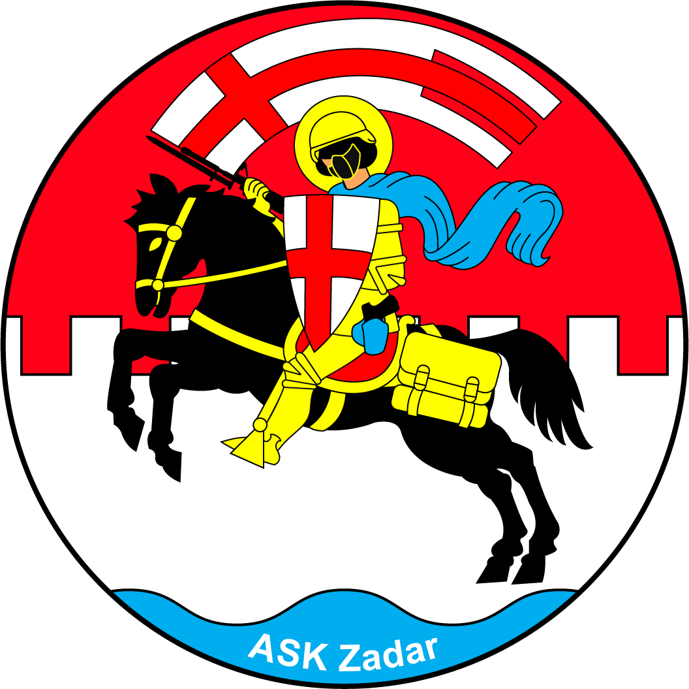

  

<h1 align="center">
  Airsoft Klub Zadar
</h1>

Airsoft Klub Zadar (eng. Airsoft Club Zadar) is a recreational non-profit organization started by a group of friends from [Zadar, Croatia][zadar-maps] who enjoy playing airsoft 🔫. We also like going for hikes ⛰️, camping 🏕️, cycling 🚲 , and many more activities 🚣.

This app is developed to share our adventures, updates to our gear, to organize and announce upcoming events and connect with our members and followers.

🚧 Please be aware that since this is a personal side-project, it is still a work in progress. 🚧

## Connect with us

- [Facebook][facebook-page]

## Getting Started

If you are interested in what out app looks like, but don't want to run the project, check out links below:

- [Guest view](#guest-view)
- [Member view](#member-view)

Some of the currently implemented and planned features are:

- Registration
- Sign in
- Home
- Dark mode
- Mobile support
- Blog post editor
- Blog post (Member view)
- Blog post (Guest view)
- About us 🚧
- Contacts 🚧
- Admin panel 🚧

## Guest view

## Member view

### Desktop

### Mobile

  

Before running the project install project dependencies by running:

### `yarn`

To start the project run:

### `yarn start`

Open [http://localhost:3000](http://localhost:3000) to view it in the browser.

The page will reload if you make edits. 
You will also see any lint errors in the console.

This project was bootstrapped with [Create React App](https://github.com/facebook/create-react-app).

[facebook-page]: https://www.facebook.com/askzd
[zadar-maps]: https://goo.gl/maps/mCfVGGPFGudVSs9FA
